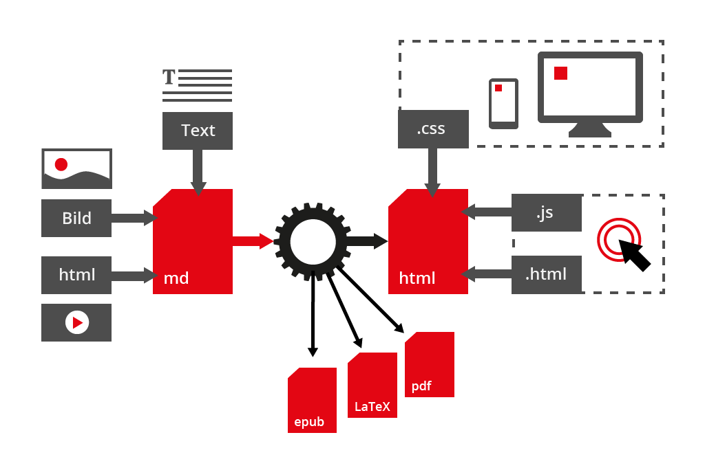

# Template elearn.js

**Name des Autors**    
Institution des Autors     
cc by-sa | 2015

\\\Textebenen///

## Überschrift 2. Ordnung

> Dies ist nur eine Template-Datei. Eine Erklärung und Dokumentation finden Sie im [Whitepaper „Digitale Skripte“](www.uni-hamburg.de).

Lorem ipsum dolor sit amet, consetetur sadipscing elitr, sed diam nonumy eirmod tempor invidunt ut labore et dolore magna aliquyam erat, sed diam voluptua. At vero eos et accusam et justo duo dolores et ea rebum. Stet clita kasd gubergren, no sea takimata sanctus est Lorem ipsum dolor sit amet.

### Überschrift dritter Ordung

Duis autem vel eum iriure dolor in hendrerit in vulputate velit esse molestie consequat, vel illum dolore eu feugiat nulla facilisis at vero eros et accumsan et iusto odio dignissim qui blandit praesent luptatum zzril delenit augue duis dolore te feugait nulla facilisi. Lorem ipsum dolor sit amet, consectetuer adipiscing elit, sed diam nonummy nibh euismod tincidunt ut laoreet dolore magna aliquam erat volutpat.   

#### Und hier ist die vierte Ordnung

Lorem ipsum dolor sit amet, consetetur sadipscing elitr, sed diam nonumy eirmod tempor invidunt ut labore et dolore magna aliquyam erat, sed diam voluptua. At vero eos et accusam et justo duo dolores et ea rebum. Stet clita kasd gubergren, no sea takimata sanctus est Lorem ipsum dolor sit amet. Lorem ipsum dolor sit amet, consetetur sadipscing elitr, sed diam nonumy eirmod tempor invidunt ut labore et dolore magna aliquyam erat, sed diam voluptua. At vero eos et accusam et justo duo dolores et ea rebum. Stet clita kasd gubergren, no sea takimata sanctus est Lorem ipsum dolor sit amet.

##### Wenn man noch eine fünfte Ebene braucht

At vero eos et accusamus et iusto odio dignissimos ducimus qui blanditiis praesentium voluptatum deleniti atque corrupti quos dolores et quas molestias excepturi sint occaecati cupiditate non provident, similique sunt in culpa qui officia deserunt mollitia animi, id est laborum et dolorum fuga. Et harum quidem rerum facilis est et expedita distinctio.

\\\Abbildungen///

### Bilder

Bilder können als einzelne Abbildungen oder als Galerien eingebunden werden.Für die Galerien wird das elearn.js benötigt. es bietet verschiedene Varianten. Das erste Beispiel zeigt eine Slideshow mit Vorschau und Loop-Funktion.

<ul class="img-gallery" id="x" style="list-style:none;">
<li>
Markdown ist kinderleicht zu erlernen.
</li>
<li>
Zusammenspiel der Komponenten bei der Produktion von digitalen Skripten mit Markdown.
"</li>
<li>
Die Zukunft von Markdown als Autorensprache.
</li>
<li>
Markdown kann viele verschiedene Medientypen in Html einfügen.
</li>
<li>
Versuche auch mal, ein Markdown-Dokument zu erstellen. Ist gar nicht schwer!
</li>
</ul>

Die Galerie kann mit oder ohne Vorschaubilder sowie mit oder ohne Loop genutzt werden. Hierzu existieren verschiedene Klassen, die dem Slider zugeordnet werden können. Das sieht folgendermaßen aus:

* `
` ist ohne Vorschau und ohne Loop
* `
` ist mit Vorschaubildern und ohne Loop
* `
` ist mit Vorschaubildern und mit Loop

Die Höhe der Gaalerie kann vorgegeben werden, damit der Content unter der Galerie nicht springt. Dies geht in Abhängigkeit des größten Bildes oder einer vorgegebenen maximalen Höhe. Dies wird durch die Klasse des umschließenden `ul`-Elements definiert.

* `<ul class="img-gallery">` ist eine Galerie mit unterschiedlicher Bilderhöhe.
* `<ul class="img-gallery fixed-size">` ist eine Galerie mit der Höhe des größten Bildes.
* `<ul class="img-gallery fixed-size" style="max-height: 400px">` ist eine Galerie mit der Höhe von 400px.

\\\Medien///

### Medieneinbindung

Hier sollen vor allem Video und Audio-Einbindung demonstriert werden. At vero eos et accusamus et iusto odio dignissimos ducimus qui blanditiis praesentium voluptatum deleniti atque corrupti quos dolores et quas molestias excepturi sint occaecati cupiditate non provident, similique sunt in culpa qui officia deserunt mollitia animi, id est laborum et dolorum fuga. Et harum quidem rerum facilis est et expedita distinctio.

#### Videos als Asset

Hier wird ein Video eingebunden, welches sich direkt im Asset-Ordner des Skrips befindet. Diese Lösung ist nur für relativ kurze Videos empfehlenswert (max. fünf Minuten).

<video preload="auto" controls="controls" style="max-width:100%">
    <source src="assets/img/beispiel-video.mp4" type="video/mpeg">
    <source src="assets/img/beispiel-video.webm" type="video/webm">
           Dein Browser unterstützt kein HTML5-Video. Um dir das Video dennoch ansehen zu können,
           folge einfach diesem <a href="assets/img/beispiel-video.mp4">Link</a>.
</video>

#### Videos von einem Streaming Server

Hier ist ein Video von einem Streaming-Server als iFrame eingebunden.

<iframe src='https://lecture2go.uni-hamburg.de/liferay-jedi-theme/javascript/strobe/embed.html?src=https://fms.rrz.uni-hamburg.de/vod/_definst_/mp4:8l2gbal1768/64.280_werz_2013-06-26_16-15.mp4/manifest.f4m&poster=https://lecture2go.uni-hamburg.de/images/64.280_werz_2013-06-26_16-15.jpg' class='strobemediaplayback-video-player' type='text/html' width='500' height='250'> </iframe>

#### Audio-Files

Da Audio-Dateien als mp3s in der Regel nicht so groß sind, dass ein Streaming-Server benötigt wird, können diese aus dem Assets-Ordner progressiv als Download eingebunden worden. Hier ein Beispiel:

<audio preload="auto" controls="controls">
    <source src="assets/img/beispiel-audio.mp3" type="audio/mpeg">
           Dein Browser unterstützt kein HTML5-Audio. Um dir das Audio-File dennoch anhören zu können,
           folge einfach diesem <a href="img/beispiel-audio.mp3">Link</a>.
</audio>

\\\Mathematische Formeln///

### Mathematische Formeln

Ut wisi enim ad minim veniam, quis nostrud exerci tation ullamcorper suscipit lobortis nisl ut aliquip ex ea commodo consequat. Duis autem vel eum iriure dolor in hendrerit in vulputate velit esse molestie consequat, vel illum dolore eu feugiat nulla facilisis at vero eros et accumsan et iusto odio dignissim qui blandit praesent luptatum zzril delenit augue duis dolore te feugait nulla facilisi.   

#### Formeldarstellung via MathJax

Nam liber tempor cum soluta nobis eleifend option congue nihil imperdiet doming id quod mazim placerat facer possim assum.

$
M = \begin{bmatrix}
       \frac{5}{6} & \frac{1}{6} & 0           \\[0.3em]
       \frac{5}{6} & 0           & \frac{1}{6} \\[0.3em]
       0           & \frac{5}{6} & \frac{1}{6}
     \end{bmatrix}
$

Duis autem vel eum iriure dolor in hendrerit in vulputate velit esse molestie consequat, vel illum dolore eu feugiat nulla facilisis.   

$P\left(A=2\middle|\frac{A^2}{B}>4\right)$

At vero eos et accusam et justo duo dolores et ea rebum. Stet clita kasd gubergren, no sea takimata sanctus est Lorem ipsum dolor sit amet. Lorem ipsum dolor sit amet, consetetur

\\\Quiz///

### Quizfragen

Auf dieser Seite sind einige Quiz-Fragen Beispielhaft dargestellt.

<h4>Auf welcher Technologie basieren die digitalen Skripte? </h4> <!-- Fragentext -->

<label>Lösung: <input type="text" name="q"/></label>

Deine Antwort ist richtig.

Leider nein, schaue dir doch nochmal die Dokumentation an.

<a class="ans">4c4ad5fca2e7a3f74dbb1ced00381aa4</a>
<a class="ans">2182a74bab7188d959e795d9301e87ff</a>
<a class="ans">590fc197fe73db0aa2ec03687a372eea</a>
<a class="ans">686155af75a60a0f6e9d80c1f7edd3e9</a>
<a class="ans">c7a628cba22e28eb17b5f5c6ae2a266a</a>

<h4>Welche Unterordner werden in der Dateistruktur von digitalen Skripten erwartet?</h4>

<label><input type="checkbox" name="q" value="Frage2-1"/>assets</label>
<label><input type="checkbox" name="q" value="Frage2-2"/>movies</label>
<label><input type="checkbox" name="q" value="Frage2-3"/>img</label>
<label><input type="checkbox" name="q" value="Frage2-4"/>css</label>
<label><input type="checkbox" name="q" value="Frage2-5"/>lang</label>

Genau, diese Ordner werden auf jeden Fall benötigt. Sogar noch ein paar mehr.

In deiner Antwort ist mindestens ein Ordner, der nicht unbedingt benötigt wird.

<a class="ans">b5ceb729a1b347aa357790e1588c88b3</a>
<a class="ans">1fd302a9c89fc92eead418857a7e5a07</a>
<a class="ans">4fc364339b2127eb81c13ab986a27085</a>
<a class="ans">a66ed4f718095c6e9d9d13a5d5ad60a3</a>

Es existieren auch noch andere Fragetypen, diese sind in der Dokumentation vom quiz.js beschrieben.

\\\Literatur///

### Literatur

Adapt learning community. (o. J.). Abgerufen 11. September 2015, von https://community.adaptlearning.org

H5P – Create, share and reuse interactive HTML5 content in your browser. (o. J.). Abgerufen 11. September 2015, von https://h5p.org

The Ultimate List of HTML5 eLearning Authoring Tools. (o. J.). Abgerufen von http://elearningindustry.com/the-ultimate-list-of-html5-elearning-authoring-tools

Wenz, C. (2014). JavaScript: das umfassende Handbuch  (11. Aufl). Bonn: Galileo Press.

Zillgens, C. (2013). Responsive Webdesign: reaktionsfähige Websites gestalten und umsetzen. München: Hanser.
