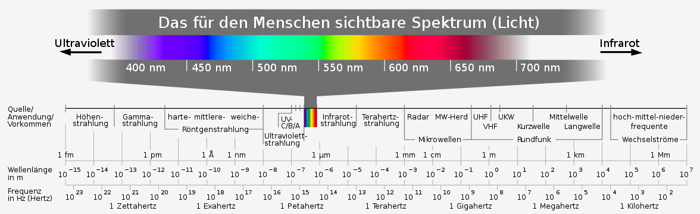
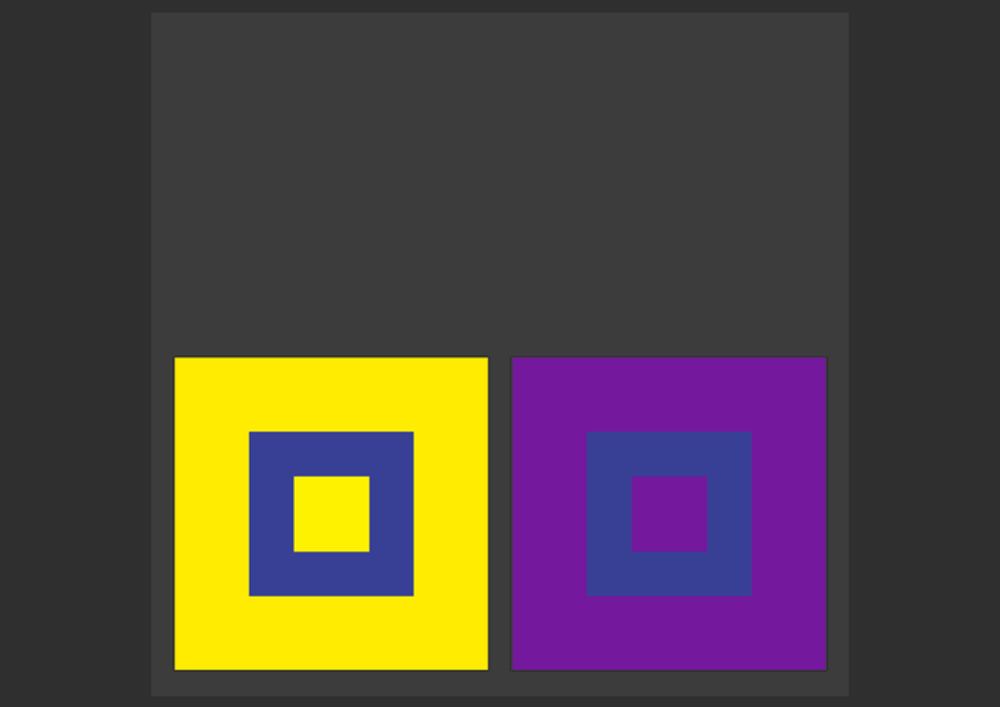
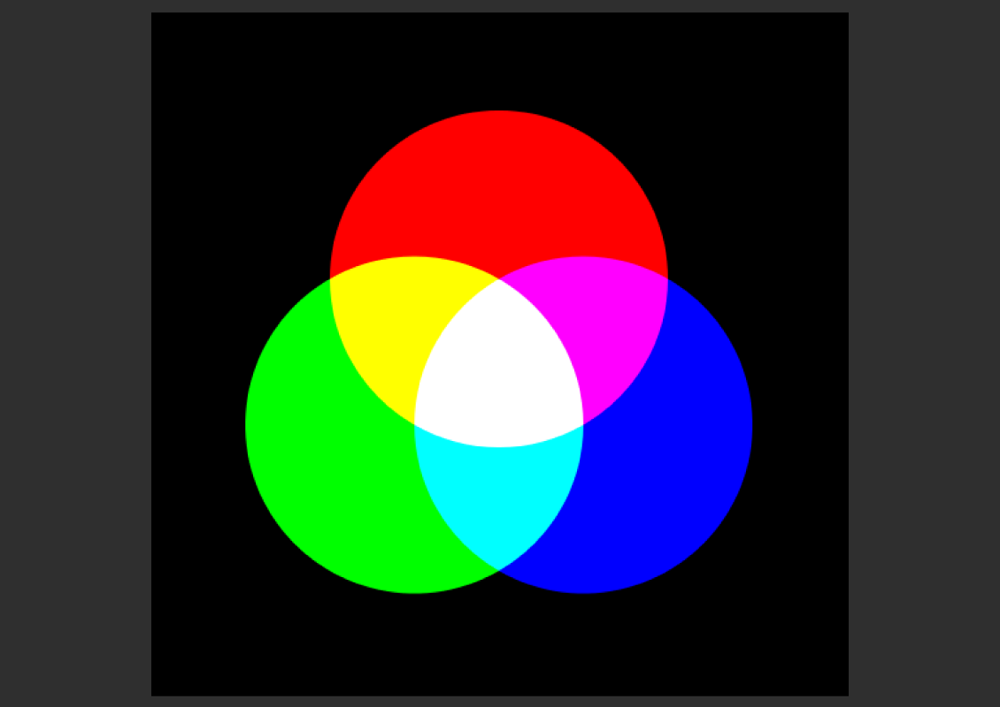
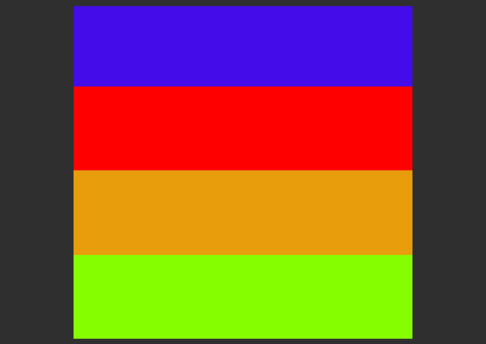

# Template elearn.js 

**Name des Autors**    
Institution des Autors     
cc by-sa | 2015

///Textebenen\\\

## Überschrift 2. Ordnung

> Dies ist nur eine Template-Datei. Eine Erklärung und Dokumentation finden Sie im [Whitepaper „Digitale Skripte“](www.uni-hamburg.de). 

Lorem ipsum dolor sit amet, consetetur sadipscing elitr, sed diam nonumy eirmod tempor invidunt ut labore et dolore magna aliquyam erat, sed diam voluptua. At vero eos et accusam et justo duo dolores et ea rebum. Stet clita kasd gubergren, no sea takimata sanctus est Lorem ipsum dolor sit amet. 

### Überschrift dritter Ordung

Duis autem vel eum iriure dolor in hendrerit in vulputate velit esse molestie consequat, vel illum dolore eu feugiat nulla facilisis at vero eros et accumsan et iusto odio dignissim qui blandit praesent luptatum zzril delenit augue duis dolore te feugait nulla facilisi. Lorem ipsum dolor sit amet, consectetuer adipiscing elit, sed diam nonummy nibh euismod tincidunt ut laoreet dolore magna aliquam erat volutpat.   

#### Und hier ist die vierte Ordnung

Lorem ipsum dolor sit amet, consetetur sadipscing elitr, sed diam nonumy eirmod tempor invidunt ut labore et dolore magna aliquyam erat, sed diam voluptua. At vero eos et accusam et justo duo dolores et ea rebum. Stet clita kasd gubergren, no sea takimata sanctus est Lorem ipsum dolor sit amet. Lorem ipsum dolor sit amet, consetetur sadipscing elitr, sed diam nonumy eirmod tempor invidunt ut labore et dolore magna aliquyam erat, sed diam voluptua. At vero eos et accusam et justo duo dolores et ea rebum. Stet clita kasd gubergren, no sea takimata sanctus est Lorem ipsum dolor sit amet.

##### Wenn man noch eine fünfte Ebene braucht

At vero eos et accusamus et iusto odio dignissimos ducimus qui blanditiis praesentium voluptatum deleniti atque corrupti quos dolores et quas molestias excepturi sint occaecati cupiditate non provident, similique sunt in culpa qui officia deserunt mollitia animi, id est laborum et dolorum fuga. Et harum quidem rerum facilis est et expedita distinctio.

///Abbildungen\\\

### Bilder

Bilder können als einzelne Abbildungen oder als Galerien eingebunden werden.

<strong>Abb.:</strong> Dies ist ein einfaches Bild, mit einer angepassten Bildunterschrift.

Für die Galerien wird das elearn.js benötigt. es bietet verschiedene Varianten. Das erste Beispiel zeigt eine Slideshow mit Vorschau und Loop-Funktion.

    <ul class="img-gallery" id="x">
        <li>
Dies ist eine Bildunterschrift.
</li>
        <li></li>
        <li></li>
        <li></li>
        <li></li>
        <li></li>
    </ul>

Diese Variante funktioniert auch sehr gut , wenn das JavaScript fehlt bzw. im Druck.
Das nächste Beispiel ist von der Höhe variabel, hat aber eine maximale höhe und keine Vorschau-Bilder.

        <ul class="img-gallery" <!--style="max-height: 300px"-->>
        <li></li>
        <li></li>
        <li></li>
    </ul>

Hier ist die Höhe vorgegeben durch das höchste Bild, der Rahmen springt dadurch nicht.

    <ul class="img-gallery fixed-size">
        <li></li>
        <li></li>
        <li></li>
	<li></li>
	<li></li>
	<li></li>
    </ul>
 

Hier ist die maximale Höhe fest vorgegeben. 
          

    <ul class="img-gallery fixed-size" <!--style="max-height: 200px"-->>
        <li></li>
        <li></li>
        <li></li>
    </ul>

///Medien\\\

### Medieneinbindung

Hier sollen vor allem Video und Audio-Einbindung demonstriert werden. At vero eos et accusamus et iusto odio dignissimos ducimus qui blanditiis praesentium voluptatum deleniti atque corrupti quos dolores et quas molestias excepturi sint occaecati cupiditate non provident, similique sunt in culpa qui officia deserunt mollitia animi, id est laborum et dolorum fuga. Et harum quidem rerum facilis est et expedita distinctio.

#### Videos als Asset

Hier wird ein Video eingebuundn, welches sich direkt im Asset-Ordner des Skrips befindet. Diese Lösung ist nur für relativ kurze Videos empfehlenswert (max. fünf Minuten).

#### Videos von einem Streaming Server

#### Audio-Files

### Mathematische Formeln

Ut wisi enim ad minim veniam, quis nostrud exerci tation ullamcorper suscipit lobortis nisl ut aliquip ex ea commodo consequat. Duis autem vel eum iriure dolor in hendrerit in vulputate velit esse molestie consequat, vel illum dolore eu feugiat nulla facilisis at vero eros et accumsan et iusto odio dignissim qui blandit praesent luptatum zzril delenit augue duis dolore te feugait nulla facilisi.   
 
#### Formeldarstellung via MathJax

Nam liber tempor cum soluta nobis eleifend option congue nihil imperdiet doming id quod mazim placerat facer possim assum. 

$
M = \begin{bmatrix}
       \frac{5}{6} & \frac{1}{6} & 0           \\[0.3em]
       \frac{5}{6} & 0           & \frac{1}{6} \\[0.3em]
       0           & \frac{5}{6} & \frac{1}{6}
     \end{bmatrix}
$

Duis autem vel eum iriure dolor in hendrerit in vulputate velit esse molestie consequat, vel illum dolore eu feugiat nulla facilisis.   

$P\left(A=2\middle|\frac{A^2}{B}>4\right)$

At vero eos et accusam et justo duo dolores et ea rebum. Stet clita kasd gubergren, no sea takimata sanctus est Lorem ipsum dolor sit amet. Lorem ipsum dolor sit amet, consetetur

